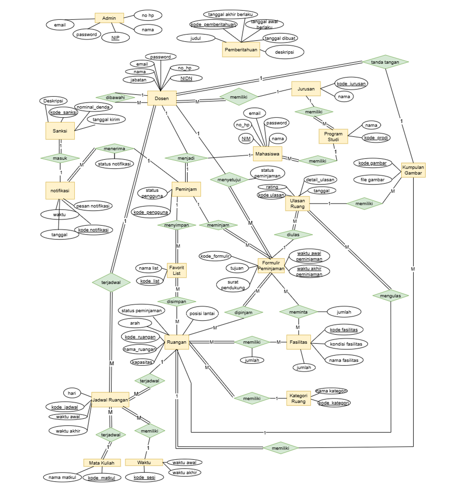

# Proyek-SMT-2-BasisData-Sistem-Peminjaman-Ruangan

Proyek **"Sistem Peminjaman Ruangan"** adalah sebuah proyek untuk memudahkan seluruh civitas akademika Politeknik Negeri Malang dalam urusan meminjam ruangan di Jurusan Teknologi Informasi. Pada semester 2 yang kami jalani ini, kami membuat rancangan basis data dari berupa ERD (Entity Relational Diagram) hingga merealisasikannya ke bentuk basis data relasional. Proyek ini sekaligus menjadi proyek kolaborasi antar mata kuliah Basis Data dengan Desain Antarmuka. Berikut adalah rincian anggota tim dari kami yang telah mengerjakan tugas ini dengan sungguh-sungguh:

- [Chiko Abilla Basya](https://github.com/Chikoabillabasya)
- [Dio Andika  Mulia Pratama](https://github.com/TamaDioo)
- [Farrel Augusta Dinata](https://github.com/FarrelAD)
- [Ivansyah Eka Oktaviadi Santoso](https://github.com/I4annet)
- [Riovaldo  Alfiyan Fahmi Rahman](https://github.com/ckckckcz)

---
## Software yang digunakan
</img>
</img>

---
## Rancangan ERD 📝

---
## Skema Basis Data ke Model Relasional 🔗
Skema basis data ke model relasional adalah pemetaan rancangan ERD yang sebelumnya sudah dibuat menjadi sebuah gambaran tabel yang nantinya diwujudkan ke dalam bentuk basis data relasional. Penjelasan lebih lanjut bisa cek link berikut:
> 👉 [Skema model relasional](model_relasional)

---
## Implementasi ke MySQL 🛢️
Berikut adalah file SQL yang kami implementasi basis data relasional MySQL
> 👉 [peminjaman_ruang.sql](peminjaman_ruang.sql)

---

---
## Tambahan 🎨
Berikut adalah desain antarmuka yang telah kami buat untuk **"Sistem Peminjaman Ruangan"** di Jurusan Teknologi Informasi Politeknik Negeri Malang:
> 👉 [Sistem Peminjaman Ruangan JTI (SIJARU)](https://www.figma.com/proto/T9ip7N5t5vgX77SQNCFjhG/Website-Peminjaman-Ruangan?page-id=0%3A1&node-id=240-3163&starting-point-node-id=240%3A3163&t=molU2xV4xUxrA0IK-1)

---
## Penutup
Puji syukur kami panjatkan ke hadirat Tuhan Yang Maha Esa, karena berkat rahmat dan karunia-Nya, laporan ini dapat diselesaikan dengan baik. Kami juga ingin mengucapkan terima kasih kepada semua pihak yang telah membantu dan memberikan dukungan selama proses penyusunan laporan ini. 

Secara khusus, kami ingin menyampaikan terima kasih yang sebesar-besarnya kepada dosen pembimbing kami, Bu Dwi Puspitasari, S. Kom., M. Kom., yang telah memberikan bimbingan, arahan, dan motivasi selama proses penyusunan laporan ini. Bantuan dan dukungan beliau sangat berharga bagi kami dalam menyelesaikan laporan ini dengan baik.

Akhir kata, kami ucapkan terima kasih atas perhatian dan kerjasamanya.

Hormat kami,