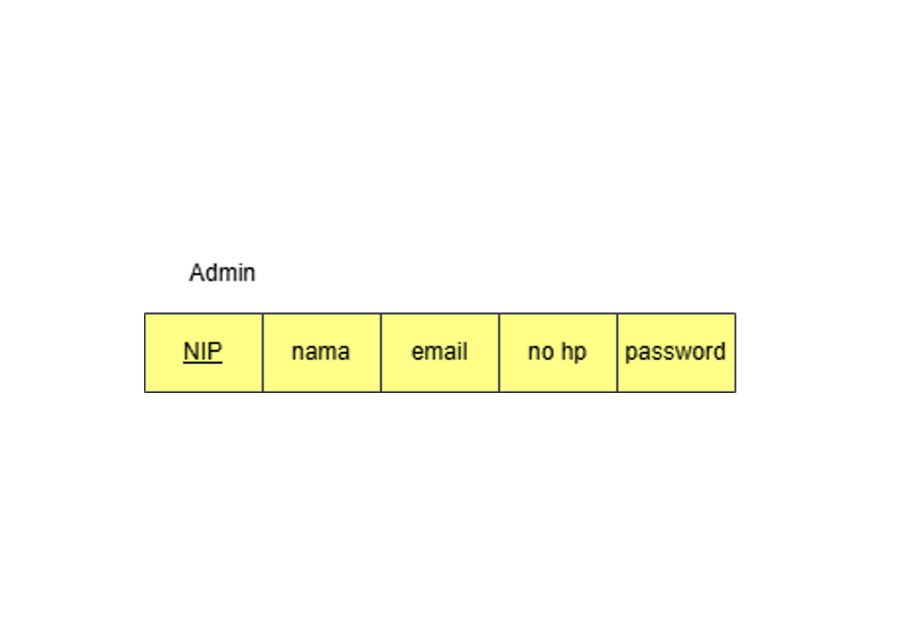
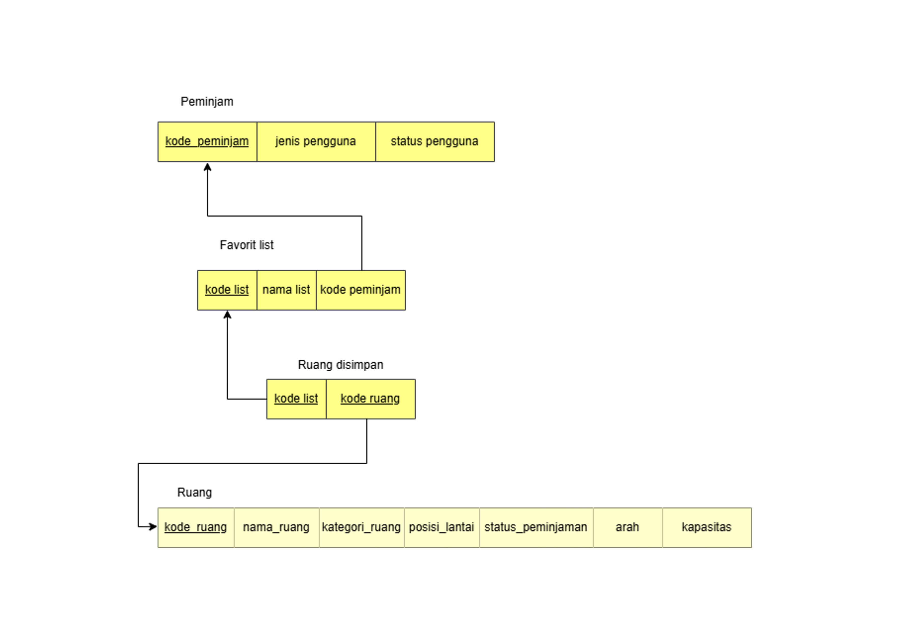
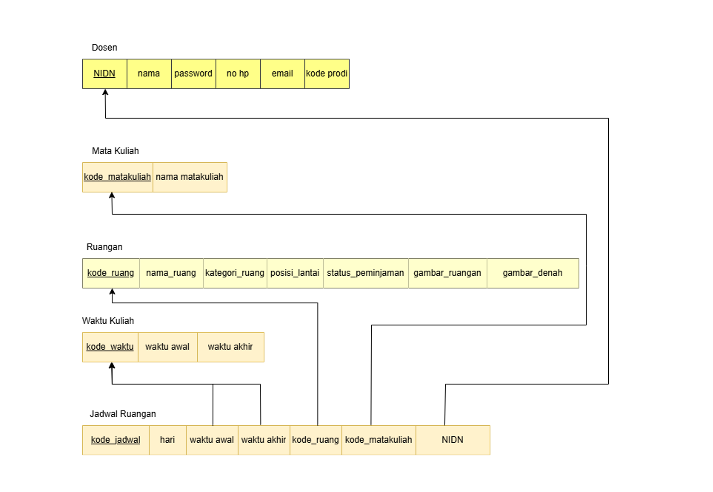
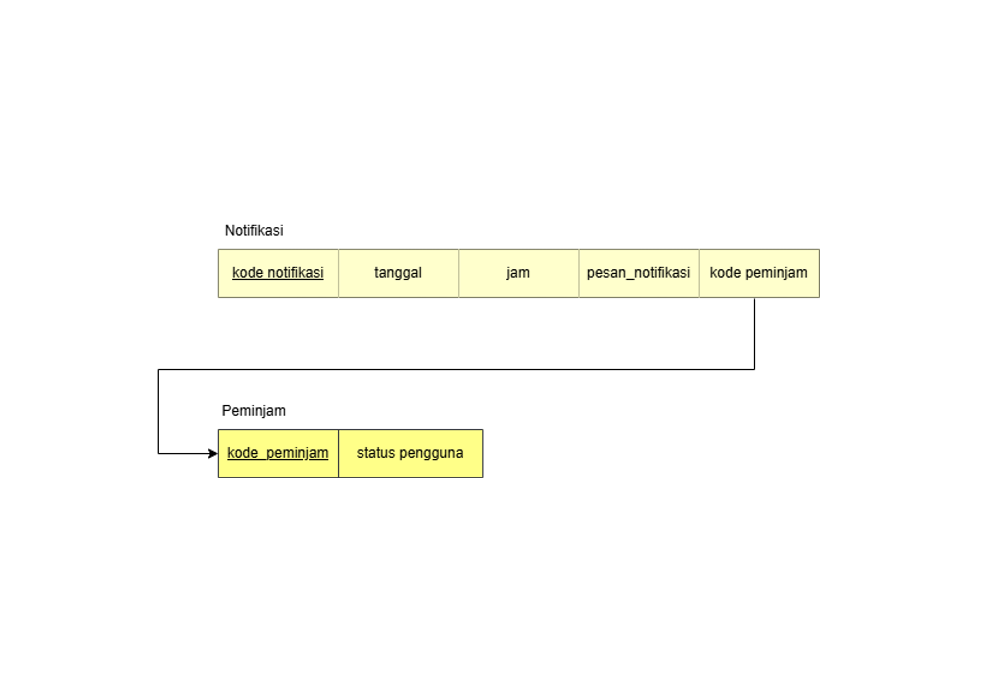
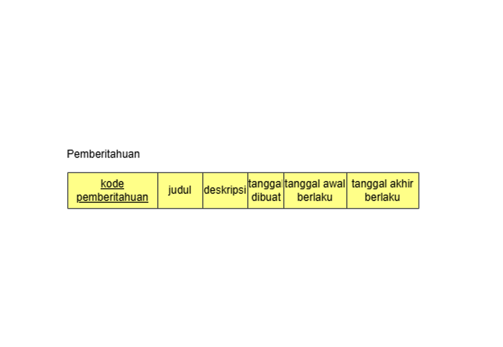
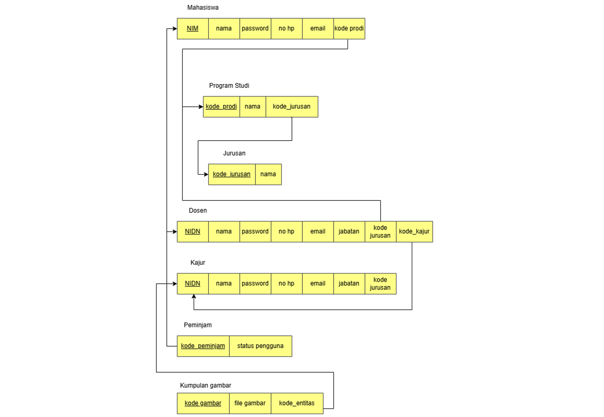
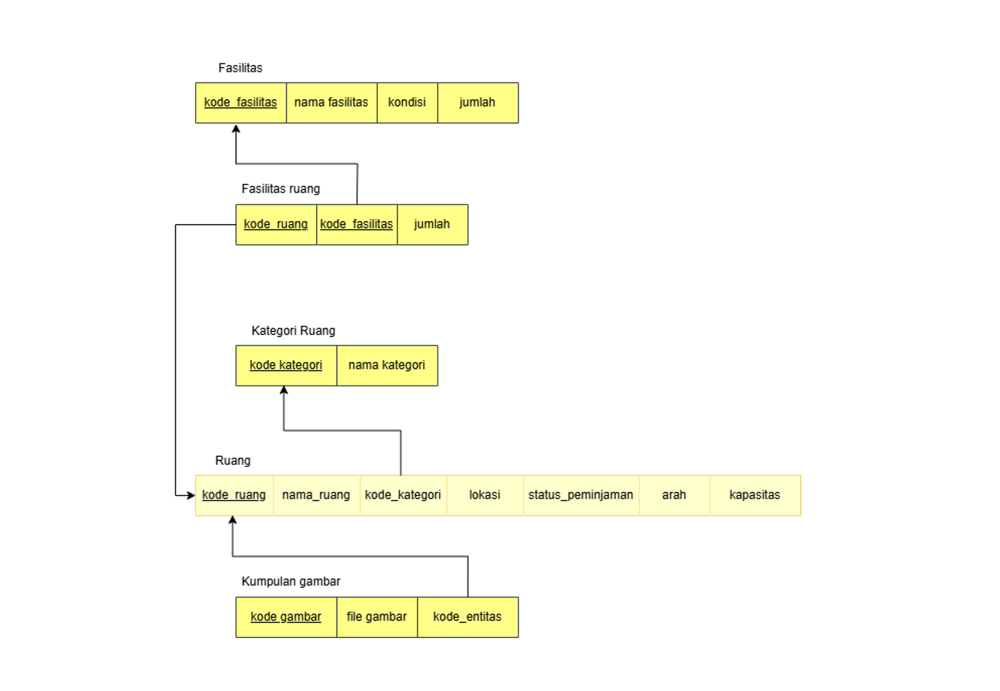
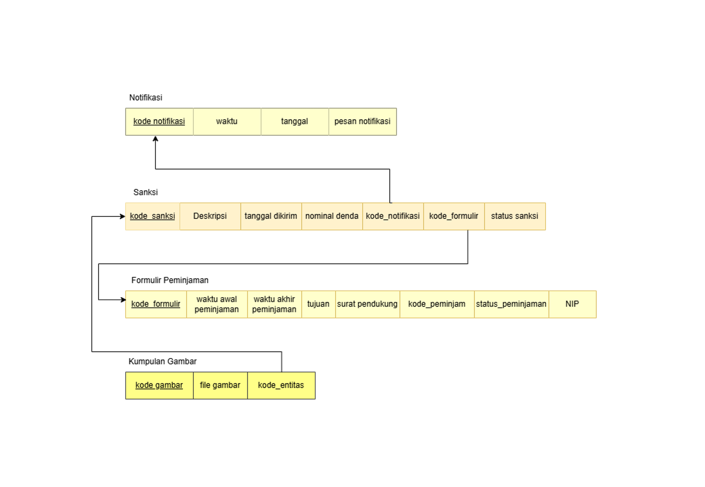
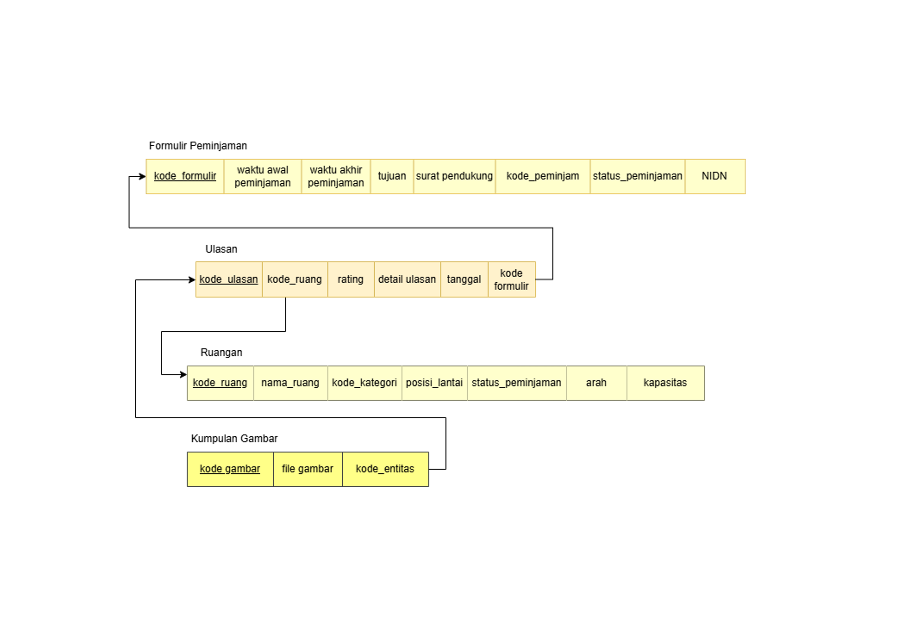

# Skema Basis Data ke Model Relasional 🔗
Tahapan ini adalah tahapan abstraksi dari rancangan ERD yang dibuat. Kami membagi skema model relasional ini ke dalam fitur-fitur yang tersedia di **"Sistem Peminjaman Ruangan"**. Untuk lebih detilnya sebagai berikut:

## 1. Admin

## 2. Favorit

## 3. Jadwal Ruangan

## 4. Notifikasi

## 5. Pemberitahuan

## 6. Peminjam

## 7. Ruangan

## 8. Sanksi

## 9. Ulasan
